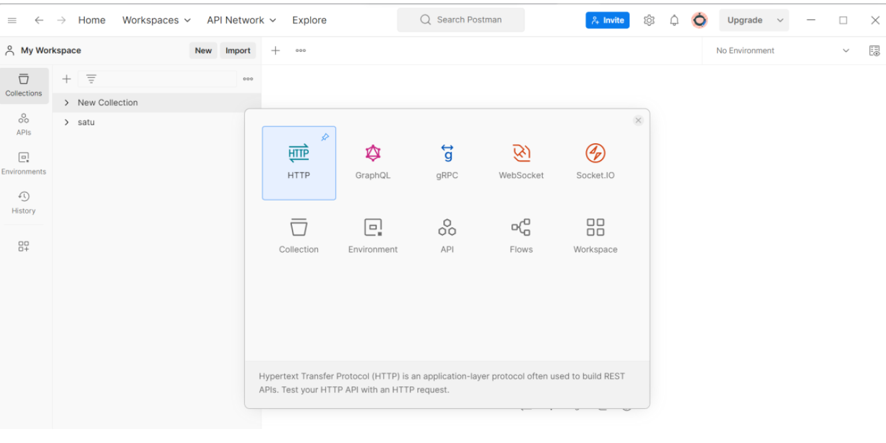

<body>
    <table border="1">
        <tr>
            <th> Nama</th>
            <th>NIM</th>
            <th>Kelas</th>
        </tr>
        <tr>
            <td>Ahmad Syukron</td>
            <td>312110056</td>
            <td>TI.21.A.1</td>
        </tr>
    </table>
</body>

# Tugas Pratikum 14
## API
## Langkah - langkah Praktikum
- <b>Persiapan</b><p>
Periapan awal adalah mengunduh aplikasi REST Client, ada banyak aplikasi yang dapat digunakan untuk keperluan tersebut. Salah satunya adalah Postman. Postman – Merupakan aplikasi yang berfungsi sebagai REST Client, digunakan untuk testing REST API. Unduh apliasi Postman dari tautan berikut: https://www.postman.com/downloads/

- <b>Membuat Model</b><p>
Pada modul sebelumnya sudah dibuat ArtikelModel, pada modul ini kita akan memanfaatkan model tersebut agar dapat diakses melalui API.

- <b>Membuat REST Controller</b><p>
Pada tahap ini, kita akan membuat file REST Controller yang berisi fungsi untuk menampilkan, menambah, mengubah dan menghapus data. Masuklah ke direktori app\Controllers dan buatlah file baru bernama Post.php. Kemudian, salin kode di bawah ini ke dalam file tersebut:<p>

```bash
<?php

namespace App\Controllers;

use CodeIgniter\RESTful\ResourceController;
use CodeIgniter\API\ResponseTrait;
use App\Models\ArtikelModel;

class Post extends ResourceController
{
    use ResponseTrait;
    // all user
    public function index()
    {
        $model = new ArtikelModel();
        $data['artikel'] = $model->orderBy('id', 'DESC')->findAll();
        return $this->respond($data);
    }
    // create
    public function create()
    {
        $model = new ArtikelModel();
        $data = [
            'judul' => $this->request->getVar('judul'),
            'isi' => $this->request->getVar('isi'),
        ];
        $model->insert($data);
        $respond = [
            'status' => 201,
            'error'  => null,
            'messages' => [
                'success' => 'Data artikel berhasil ditambahkan.'
            ]
        ];
        return $this->respondCreated($respond);
    }
    // single user
    public function show($id = null)
    {
        $model = new ArtikelModel();
        $data = $model->where('id', $id)->first();
        if ($data) {
            return $this->respond($data);
        } else {
            return $this->failNotFound('Data tidak ditemukan.');
        }
    }
    // update
    public function update($id = null)
    {
        $model = new ArtikelModel();
        $id = $this->request->getVar('id');
        $data = [
            'judul' => $this->request->getVar('judul'),
            'isi' => $this->request->getVar('isi'),
        ];
        $model->update($id, $data);
        $respond = [
            'status'    => 200,
            'error'     => null,
            'messages'  => [
                'success' => 'Data Artikel berhasil diubah.'
            ]
        ];
        return $this->respond($respond);
    }
    // delete
    public function delete($id = null)
    {
        $model = new ArtikelModel();
        $data = $model->where('id', $id)->delete($id);
        if ($data) {
            $model->delete($id);
            $respond = [
                'status'    => 200,
                'error'     => null,
                'messages'  => [
                    'succes' => 'Data artikel berhasil duhapus.'
                ]
            ];
            return $this->respondDeleted($respond);
        } else {
            return $this->failNotFound('Data tidak ditemukan.');
        }
    }
}
```
Kode diatas berisi 5 method, yaitu:<p>
• index() – Berfungsi untuk menampilkan seluruh data pada database.<p>
• create() – Berfungsi untuk menambahkan data baru ke database.<p>
• show() – Berfungsi untuk menampilkan suatu data spesifik dari database.<p>
• update() – Berfungsi untuk mengubah suatu data pada database.<p>
• delete() – Berfungsi untuk menghapus data dari database.<p>

- <b>Membuat Routing REST API</b><p>
Untuk mengakses REST API CodeIgniter, kita perlu mendefinisikan route-nya terlebih dulu. Caranya, masuklah ke direktori app/Config dan bukalah file Routes.php. Tambahkan kode di bawah ini:<p>
```bash
$routes->resource('post');
```
Untuk mengecek route nya jalankan perintah berikut:<p>
```bash
php spark routes
```
Selanjutnya akan muncul daftar route yang telah dibuat.<p>
<p>
Seperti yang terlihat, satu baris kode routes yang di tambahkan akan menghasilkan banyak Endpoint.<p>
Selanjutnya melakukan uji coba terhadap REST API CodeIgniter.<p>

- <b>Testing REST API CodeIgniter</b><p>
Buka aplikasi postman dan pilih create new → HTTP Request<p>


- <b>Menampilkan Semua Data</b><p>
Pilih method GET dan masukkan URL berikut:<p>
```bash
http://localhost:8080/post
```
Lalu, klik Send. Jika hasil test menampilkan semua data artikel dari database, maka pengujian berhasil.<p>
<p>

- <b>Menampilkan Data Spesifik</b><p>
Masih menggunakan method GET, hanya perlu menambahkan ID artikel di belakang URL seperti ini:<p>
```bash
http://localhost:8080/post/2
```
Selanjutnya, klik Send. Request tersebut akan menampilkan data artikel yang memiliki ID nomor 2 di database.<p>
<p>


- <b>Mengubah Data</b><p>
Untuk mengubah data, silakan ganti method menjadi <b>PUT</b>. Kemudian, masukkan URL artikel yang ingin diubah. Misalnya, ingin mengubah data artikel dengan ID nomor 2, maka masukkan URL berikut:<p>
```bash
http://localhost:8080/post/2
```
Selanjutnya, pilih tab <b>Body</b>. Kemudian, pilih <b>x-www-form-uriencoded</b>. Masukkan nama atribut tabel pada kolom <b>KEY</b> dan nilai data yang baru pada kolom <b>VALUE</b>. Kalau sudah, klik <b>Send</b>.<p>
<P>

- <b>Menambahkan Data</b><p>
Anda perlu menggunakan method <b>POST</b> untuk menambahkan data baru ke database. Kemudian, masukkan URL berikut:<p>
```bash
http://localhost:8080/post
```
Pilih tab <b>Body</b>, lalu pilih <b>x-www-form-uriencoded</b>. Masukkan atribut tabel pada kolom <b>KEY</b> dan nilai data baru di kolom <b>VALUE</b>. Jangan lupa, klik <b>Send</b>.<p>
<p>

- <b>Menghapus Data</b><p>
Pilih method <b>DELETE</b> untuk menghapus data. Lalu, masukkan URL spesifik data mana yang ingin di hapus. Misalnya, ingin menghapus data nomor 4, maka URL-nya seperti ini:<p>
```bash
http://localhost:8080/post/4
```
Langsung saja klik <b>Send</b>, maka akan mendapatkan pesan bahwa data telah berhasil dihapus dari database.<p>
<p>

# END
